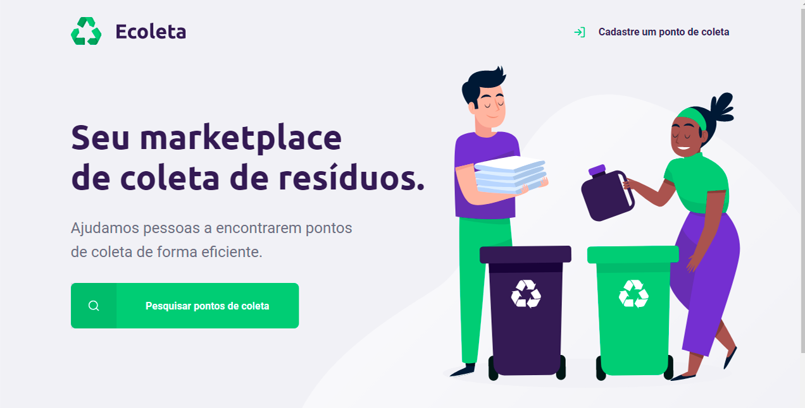

<p align="center">
   <a target="_blank" rel="Ecoleta" href="https://github.com/Rocketseat"></a><br>
</p>

<h1 align="center">Next Level Week</h1> 
<blockquote align="center">No NLW você vai aprender na prática os principais fundamentos dodesenvolvimento
web e vai conhecer o caminho para acelerar na direção dos seus objetivos.</blockquote>
</p>

<h3 align="center">Home do Site</h3>
<p align="center">
   <a target="_blank" rel="Ecoleta" href="https://github.com/Rocketseat"></a><br>
</p>

<h3 align="center">Pagina de Cadastro</h3>
<p align="center">
   <a target="_blank" rel="PageCadastro" href="https://github.com/Rocketseat"></a><br>

<h3 align="center">Pesquisa</h3>
<p align="center">
   <a target="_blank" rel="Search-Results" href="https://github.com/Rocketseat"></a><br>

<h3 align="center">Resultado da Pesquisa</h3>
<p align="center">
   <a target="_blank" rel="Search-Results" href="https://github.com/Rocketseat"></a><br>


## Guia de conteúdo

<li><a href="#recursos">Recursos</a></li><br>
<li><a href="#pacotes">Pacotes/Dependências</a></li><br>
<li><a href="#começando">Como começar?</a></li><br>
<li><a href="#faq">FAQ</a></li><br>

## <a id="recursos"></a> Recursos

✅ Pesquise os pontos de coleta para poder deixar os resíduos de acordo com o perfil do resíduo.<br>

✅ Cadastre o ponto de coleta de resíduos da sua empresa.<br>

✅ A empresa avisa com antecedência quais tipos de resíduos a ser coletado.<br>

## <a id="pacotes"></a>  Como começar?
<b> Instalação de dependências</b>

Instale via npm os seguintes pacotes
````````````````````
npm install express -> Dependência
````````````````````
````````````````````
npm install nunjucks -> Dependência
````````````````````
````````````````````
npm install nodemon -> monitoramento de alterações realizados no json
````````````````````


## <a id="começando"></a>  Como começar?

<b> Executando o projeto</b>

Para iniciar o servidor rode o seguinte comando abaixo, e em um navegador de sua preferencia acesse o endereço (http://localhost:3000/)

```````````````
npm start
```````````````
## <a id="faq"></a> FAQ

<b>Pergunta:</b> Quais são as tecnologias usadas neste projeto?

<b>Resposta:</b> As tecnologias usadas neste projeto são...

✅ HTML 5 <br>
✅ CSS 3<br>
- Pré-processador SASS/SCSS
- ITCSS ajuda você a fazer o projeto CSS escalável e sustentável.
- Metodologia RSCSS.<br>
✅ JavaScipt
✅ Pacote Express
✅ Pacote Nunjucks
✅ Pacote Nodemon

