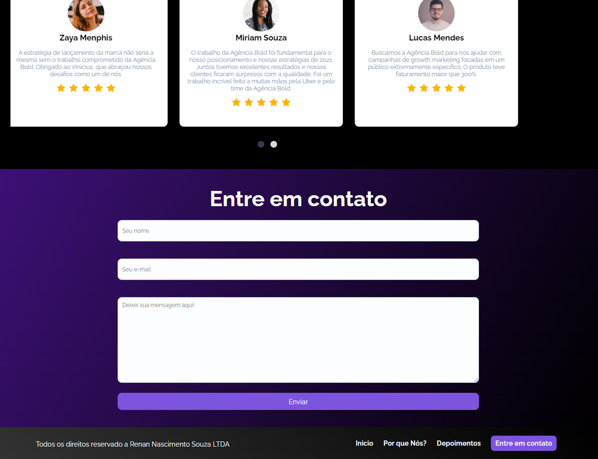

<h1 align="center">Agencia Digital</h1> 
<blockquote align="center">Website desenvolvido para atender as necessidades de uma agencia, podendo se adaptar a qualquer ramo de atividade, caso seja necesarrio.</blockquote>

<h3 align="center">Home do Site</h3>

    

<h3 align="center">Sobre</h3>

    

<h3 align="center">Beneficios/Depoimentos</h3>

    

<h3 align="center">Contato</h3>

    

## 🚀 Tecnologias

✅ HTML 5  
✅ CSS 3 
✅ JavaScipt

## :memo: Licença

Esses projetos está sob a licença MIT.

