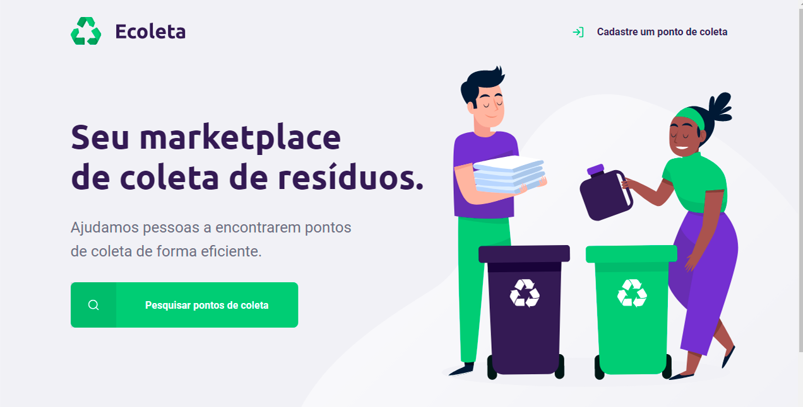
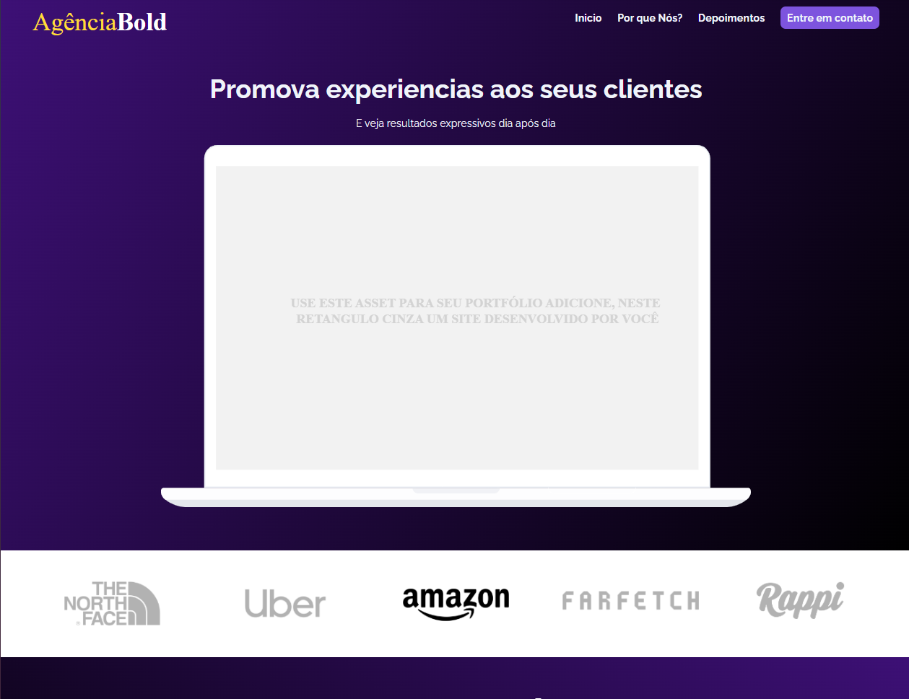
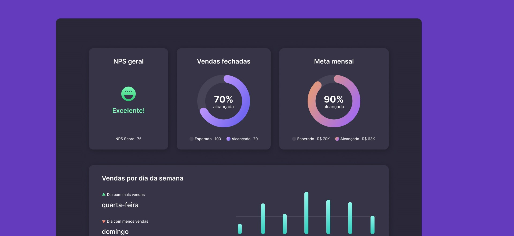

# Portifolio

<h1 align="center">Projetos</h1> 

    Access the projects below for more information.  
     
     <table>
    <thead>
        <tr>
            <th align="center">
                 
                

                    <small>#</small>
                

            </th>
            <th align="center">
                 
                
 
                    <small>
                        NAME
                    </small>
                

            </th>
            <th align="center">
                
                
 
                    <small>
                    RELEASE DATE
                    </small>
                

            </th>
            <th align="center">
                
                
 
                    <small>
                    PREVIEW
                    </small>
                

            </th>
        </tr>
    </thead>
    <tbody>
        <tr>
            <td>01</td>
            <td><a href="Projeto-01">WebColeta</a></td>
            <td>10/06/2021</td>
            <td align="center">
            </td>
        </tr>
        <tr>
            <td>02</td>
            <td><a href="Projeto-02">AgenciaWeb</a></td>
            <td>18/02/23</td>
            <td align="center">
            </td>
        </tr>
        <tr>
            <td>03</td>
            <td><a href="Projeto-03">DashBoard</a></td>
            <td>07/03/2023</td>
            <td align="center">
            </td>
        </tr>        
    </tbody>
</table>
